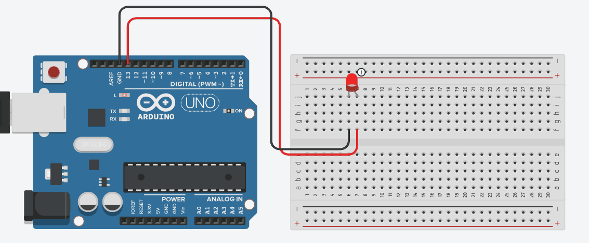
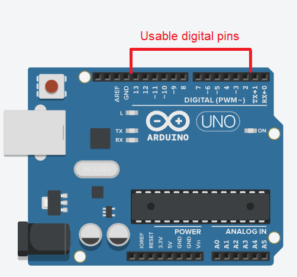
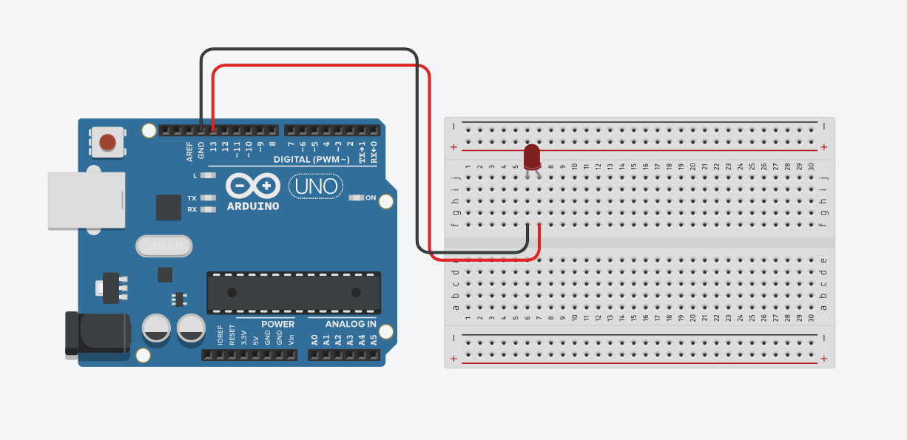

# Arduino 101 - The very basics
In this guide, we will learn how to blink a single LED using an Arduino board. This is a very simple but essential project that helps to understand how to control electronic components using a microcontroller.

## Output
**This is how the project should look like after completion:**
<br> <p align="center"></p>

## Components you'll need
What You Will Need:
* 1 x Arduino board (e.g., Arduino Uno)
* 1 x LED (any color)
* Breadboard and jumper wires
* USB cable to connect the Arduino to your computer

## Circuitry
First, let's prepare the circuit.
1. **Place the LED on the Breadboard:** <br> Insert the LED into the breadboard. LEDs have two legs: a longer one (anode, positive) and a shorter one (cathode, negative). The longer leg should be connected to the positive side - remember this for the next steps.
2. **Connect to Arduino:** <br> Take a jumper wire from the positive pin of the LED and connect it to any of the digital pins (We connected to pin 13) of the Arduino. On an Arduino UNO, the digital pins are on the right side (They're marked as "DIGITAL") and are numbered from 0 to 13. We can use any of the pins except pin 0 and pin 1. Those have special use cases. Then connect the negative pin of the LED to one of the GNDs of Arduino (any one is fine). 
<br> <p align="center"></p>
3. **Upload the code:** <br> Now connect the Arduino to your Desktop/Laptop and upload the code from Arduino IDE.

**This is the full circuit diagram:**
<br> <p align="center"></p>


## Coding time
Below is the code to make the LED blink. We’ll go through it line by line to understand how it works.

```cpp
int LED = 13;

void setup() {
  pinMode(LED, OUTPUT);
}

void loop() {
  digitalWrite(LED, HIGH);          // turn the LED on (HIGH is the voltage level)
  delay(1000);                      // wait for a second
  digitalWrite(LED, LOW);           // turn the LED off by making the voltage LOW
  delay(1000);                      // wait for a second
}
```

### Code explanation
**1. Declaring the LED Pin:**
```cpp
int LED = 13;
```
This line declares a variable named `LED` and assigns it the value `13`. In this context, `13` refers to the digital pin on the Arduino board to which we connected the LED. We're actually giving the pin `13` a name, which is "LED". You can give it any name you want to. But later on, you'll have to use the exact same name when you refer to this pin.

Alternatively, you can also write it like this:
```cpp
#define LED 13
```

.

**2. Setup function:**
```cpp
void setup() {
  pinMode(LED, OUTPUT);
}
```
The ` setup() ` function runs once when the Arduino is powered on. And usually, here we define the modes of the pins we use. Wait, what do you mean by "modes of pins"?

Well, you know about input and output devices, right? In the context of Arduino, whenever Arduino send power to some component, that component is considered as `output`. Hence, LEDs are output devices. Because Arduino needs to send power to them. But how does Arduino send power to an LED? well, the LED is here connected to pin 13, right? So Arduino just sends power to that pin and therefore the LED lights up! So, the mode of pin no. 13 is `output`.

> Programming languages in general use a lot of functions. Now, we know about functions from mathematics, right?
>
> For example, $`f(x,y,z) = 2x^2 + 3xy - 5z`$ is a function. And it will output different values based on the value of x, y, and z. In the same way, in programming, different functions do certain things based on the parameters given as inputs.

So, we set the pin's mode using a simple function like this - ` pinMode(LED, OUTPUT) `. Here, ` pinMode ` is the name of the function. and `LED` and `OUTPUT` are the parameters. It's setting the mode of pin `LED` as `OUTPUT`.

Also, pay attention to how the `void setup` is structured. We have a set of parentheses `()` right after ` void setup `. And the whole code is wrapped in another set of parentheses `{ ... }`. Anything in between these set of parentheses `{ }` would be considered as "inside" the `void setup` function. The function should definitely be "inside" the ` void setup `.

.

**3. The Loop:**
```cpp
void loop() {
  digitalWrite(LED, HIGH);
  delay(1000);
  digitalWrite(LED, LOW);
  delay(1000);
}
```

If you look carefully at the blinking pattern, you'll notice that the Arduino is doing the same thing again and again... A loop is happening, right? Can you break down the steps that are needed to make an LED blink like this?
1. Turn on the LED.
2. Keep it on for a set amount of time.
3. Turn off the LED.
4. Keep it off for a set amount of time.

Doing these steps in a loop will result in the LED blinking. That's what we are doing in the `void loop`.

Just as ` void setup `, we put a set of `()` right after ` void loop ` and wrap everything inside a pair of `{  }`. Anything inside ` void loop ` will be looped over and over again. That's exactly what we want!

So here's how we do it:
**Step 1:** We turn on the LED. Using this function:
```cpp
digitalWrite(LED, HIGH);
```
The function ` digitalWrite ` sends or does not send power to a certain pin. Here we're controlling the pin named `LED`, and using `HIGH`, we're commanding Arduino to send power to that pin.

**Step 2:** We wait for one second:
```cpp
delay(1000);
```
The function ` delay ` has only one parameter. It is a time value and the unit is in milliseconds. So, `delay(1000)` means the Arduino will wait for 1000 milliseconds as in 1 second.

**Step 3:** We turn off the LED:
```cpp
digitalWrite(LED, LOW);
```
`LOW` means "don't send power to that pin!!"

**Step 4:** We wait for one second:
```cpp
delay(1000);
```


### A few things to remember
* Every language has some grammar, right? In English, you need to put a fullstop (.) after each sentence. Similarly, in this programming language (and most others), you need to put a semicolon (;) after each line. There are a few exceptions though.
* Also, the names of the functions we use are case-sensitive. Meaning, `pinMode` can't be written as `PinMode` or `pinmode`. Do you see the difference?
* Most of the time, your Arduino code will have three segments. In the first segment, we define the pin numbers or create variables. Then comes `void setup` and finally comes `void loop`. Your code can only contain one `void loop` and one `void setup`.
* Do we have to give the pin a name? We named the pin 13 as "LED", right? Do we have to do that? Well, we could just use `13` everywhere, like ` pinMode(13, OUTPUT) ` and ` digitalWrite(13, HIGH) `.
<br> But it's difficult to remember what pin we've used and what if we change the pin for some reason? Let's say we connect the LED to pin 12 instead. Then we would have to change all the `13` to `12`, right?
<br> That's why it is a good practice to first give the pin a name, and then use that name in every functions where necessary. To Arduino, the name "LED" doesn't exist anyways. Wherever we use `LED`, Arduino just sees the number `13` 😛
