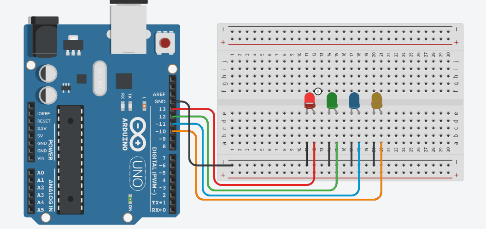
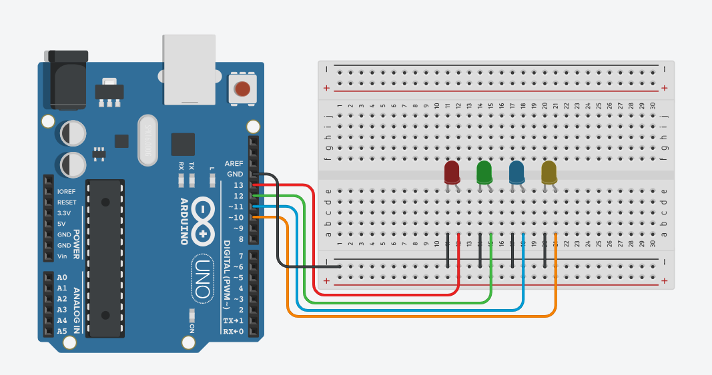

# Arduino 102 - Working with multiple LEDs
In this tutorial, we will build upon our [previous project](../001.Arduino%20101) and learn how to control four different LEDs using an Arduino! This project will give you a better understanding of how to control multiple outputs and write more complex code. If you've mastered blinking a single LED, this is a great next step!

## Output
**This is how the project should look like after completion:**
<br> <p align="center"></p>

## Components you'll Need:
* 1 x Arduino board (e.g., Arduino Uno)
* 4 x LEDs
* Breadboard and jumper wires
* USB cable to connect the Arduino to your computer

# Circuitry
First, let's prepare the circuit.
1. **Place the LEDs on the Breadboard:**<br> Insert the four LEDs into the breadboard, making sure each LED is in a different row. Remember that LEDs have two legs: the longer one (anode, positive) and the shorter one (cathode, negative).
2. **Connect the LEDs to Arduino:**<br> Take a jumper wire from each of the LED's positive pins and connect it to any of the digital pins. Here's how we've connected them in this project:
   - Red LED: Pin 13
   - Green LED: Pin 12
   - Blue LED: Pin 11
   - Yellow LED: Pin 10
3. **Ground Connections:**<br> Connect the shorter leg (cathode) of each LED to a common ground line on the breadboard. Then connect this ground line to one of the GND pins on the Arduino.

**This is the full circuit diagram:**
<br> <p align="center"></p>

## Coding time
Below is the code to make the LED blink. We’ll go through it line by line to understand how it works.

```cpp
#define LED1 13
#define LED2 12
#define LED3 11
#define LED4 10

void setup() {
  pinMode(LED1, OUTPUT);
  pinMode(LED2, OUTPUT);
  pinMode(LED3, OUTPUT);
  pinMode(LED4, OUTPUT);
}

void loop() {
  digitalWrite(LED1, HIGH);
  digitalWrite(LED2, LOW);
  digitalWrite(LED3, LOW);
  digitalWrite(LED4, LOW);
  delay(500);
  
  digitalWrite(LED1, LOW);
  digitalWrite(LED2, HIGH);
  digitalWrite(LED3, LOW);
  digitalWrite(LED4, LOW);
  delay(500);
  
  digitalWrite(LED1, LOW);
  digitalWrite(LED2, LOW);
  digitalWrite(LED3, HIGH);
  digitalWrite(LED4, LOW);
  delay(500);
  
  digitalWrite(LED1, LOW);
  digitalWrite(LED2, LOW);
  digitalWrite(LED3, LOW);
  digitalWrite(LED4, HIGH);
  delay(500);
}
```

### Code explanation
**1. Declaring the LED Pins:**
```cpp
#define LED1 13
#define LED2 12
#define LED3 11
#define LED4 10
```
These lines declare four variables named `LED1`, `LED2`, `LED3`, and `LED4` with the pin numbers assigned to them. You can use any name you want to.

Alternatively, you can also write it like this:
```cpp
int LED1 = 13;
int LED2 = 12;
int LED3 = 11;
int LED4 = 10;
```

.

**2. Setup function:**
```cpp
void setup() {
  pinMode(LED1, OUTPUT);
  pinMode(LED2, OUTPUT);
  pinMode(LED3, OUTPUT);
  pinMode(LED4, OUTPUT);
}
```
As mentioned before, the ` setup() ` function runs once when the Arduino is powered on. And here we declare the modes of the pins we're using. As LEDs need power from the Arduino, they're all set to ` OUTPUT `.

.

**3. The Loop:**
```cpp
void loop() {
  digitalWrite(LED1, HIGH);
  digitalWrite(LED2, LOW);
  digitalWrite(LED3, LOW);
  digitalWrite(LED4, LOW);
  delay(500);
  
  digitalWrite(LED1, LOW);
  digitalWrite(LED2, HIGH);
  digitalWrite(LED3, LOW);
  digitalWrite(LED4, LOW);
  delay(500);
  
  digitalWrite(LED1, LOW);
  digitalWrite(LED2, LOW);
  digitalWrite(LED3, HIGH);
  digitalWrite(LED4, LOW);
  delay(500);
  
  digitalWrite(LED1, LOW);
  digitalWrite(LED2, LOW);
  digitalWrite(LED3, LOW);
  digitalWrite(LED4, HIGH);
  delay(500);
}
```

Here, Arduino needs to do the same thing again and again. Look at the [blinking pattern](#Output). Can you figure out the steps for the Arduino to take in order to complete one loop?
1. Turn on the 1st LED. The rest should remain off.
2. Wait for a set amount of time.
3. Turn on the 2nd LED. The rest should remain off.
4. Wait for a set amount of time.
5. Turn on the 3rd LED. The rest should remain off.
6. Wait for a set amount of time.
7. Turn on the 4th LED. The rest should remain off.
8. Wait for a set amount of time.

Doing these steps in a loop will result in the LEDs blinking the way shown [here](#Output). That's what we are doing in the `void loop`.

So here's how we do it:

**Step 1 (and 2):**<br> We turn on `LED1` and keep the rest off. And then we wait for half a second.
```cpp
  digitalWrite(LED1, HIGH); //on
  digitalWrite(LED2, LOW);  //off
  digitalWrite(LED3, LOW);  //off
  digitalWrite(LED4, LOW);  //off
  delay(500);
```
Look how there's no delay in between the ` digitalWrite ` functions? Because they need to be executed at the same time.


**Step 3 (and 4):**<br> We turn on `LED2` and keep the rest off. And then we wait for half a second.
```cpp
  digitalWrite(LED1, LOW);  //off
  digitalWrite(LED2, HIGH); //on
  digitalWrite(LED3, LOW);  //off
  digitalWrite(LED4, LOW);  //off
  delay(500);
```
Just doing the same thing with LED2.


**Step 5, 6, 7, and 8:**<br> Just doing the same thing again with `LED3` and `LED4`.
```cpp
  digitalWrite(LED1, LOW);  //off
  digitalWrite(LED2, LOW);  //off
  digitalWrite(LED3, HIGH); //on
  digitalWrite(LED4, LOW);  //off
  delay(500);
```
```cpp
  digitalWrite(LED1, LOW);  //off
  digitalWrite(LED2, LOW);  //off
  digitalWrite(LED3, LOW);  //off
  digitalWrite(LED4, HIGH); //on
  delay(500);
```

## Uploading the code
Now upload the code to your Arduino.
* **Step 1:** Open Arduino IDE and write the code there.
* **Step 2:** Connect your Arduino board to your computer using a USB cable.
* **Step 3:** From `Tools > Board` select Arduino Uno (Or whatever model you're using.
* **Step 4:** From `Tools > Port` select the port your Arduino is connected. If you can't identify which port the Arduino is connected to, disconnect and connect the Arduino again. Notice which port disappears and re-appears when you do so and connect to that port.
* **Step 5:** Hit ` Ctrl + U ` on your keyboard or click on the upload button on your Arduino IDE. Wait a few seconds and the code should upload to the Arduino board.

That's it! If everything is set up correctly, the LEDs connected to pins 13, 12, 11, and 10 will start blinking in sequence!

One task for you! Can you try adding 10 LEDs? 
